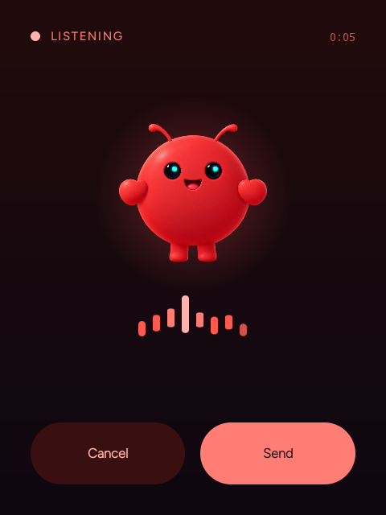
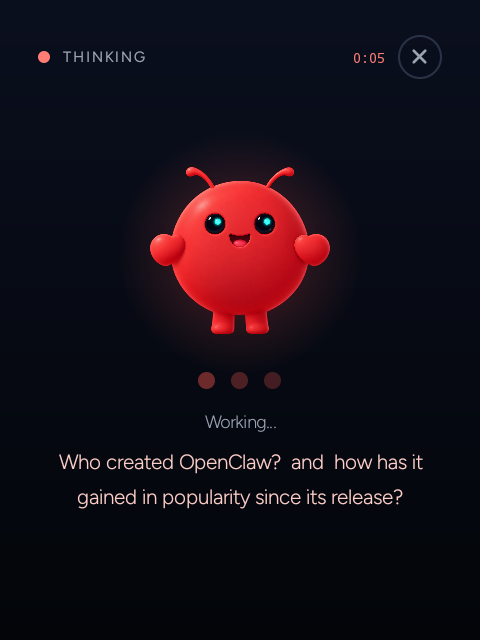
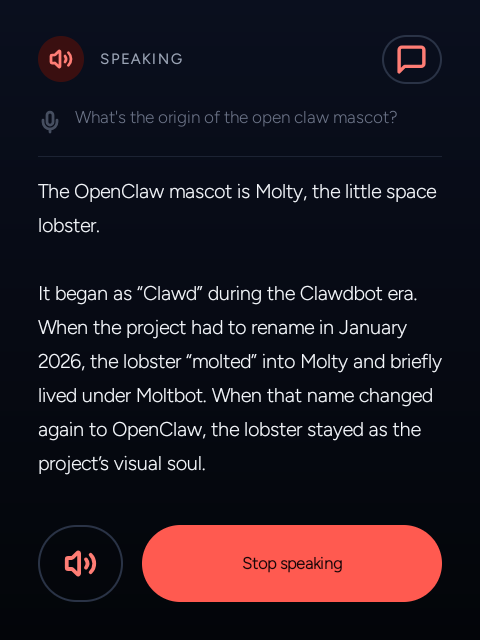
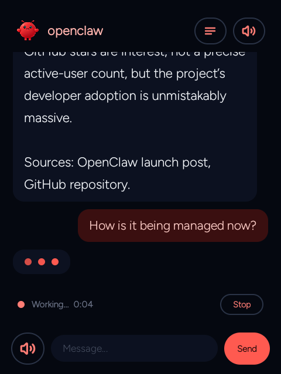
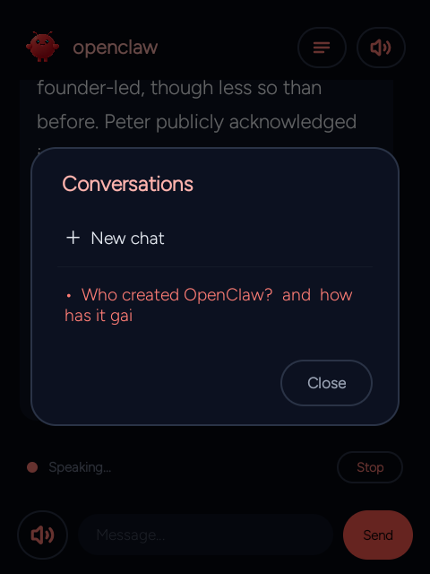
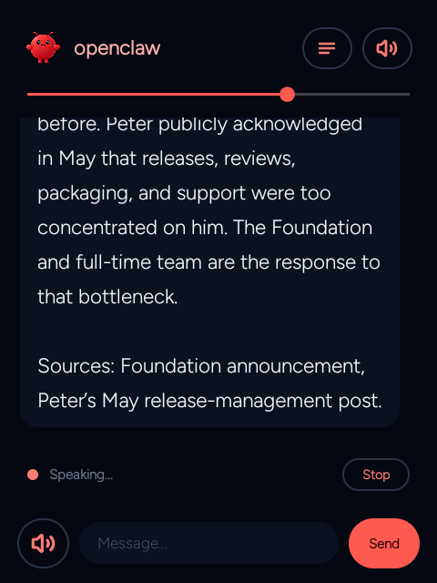
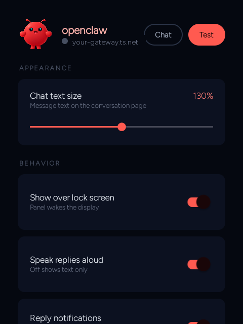
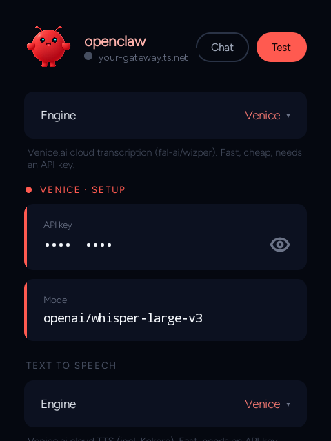
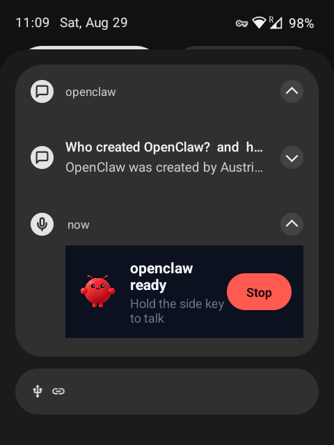

<p align="center">
  
</p>
<h1 align="center">rabbit-r1-openclaw</h1>
<p align="center"><em>Turn a Rabbit R1 into a de-Googled, hold-to-talk voice terminal.</em></p>

A toolkit that turns a **Rabbit R1** into a de-Googled, hold-to-talk voice terminal for **any
OpenAI-compatible chat gateway** (e.g. a self-hosted [OpenClaw](https://github.com/) instance
reached over Tailscale) — plus the ROM/root plumbing that makes it usable as a real pocket device.

The centerpiece is **ClawPTT** (developed in its own repo — **[github.com/mthelpme/clawptt](https://github.com/mthelpme/clawptt)**):
press and hold the R1's side button, speak, release, and your
words are transcribed, sent to your gateway, and the reply is streamed back and spoken aloud.
Around it are the device tweaks we needed to make the R1 pleasant: hide the status bar, control
the camera motor, remap the PTT key, an idle "airplane when locked" power saver, and self-hosted
speech-to-text / text-to-speech services.

> ⚠️ **Read this first — this is an advanced, root-only project.**
> - Targets a **Rabbit R1** (MediaTek MT6765) running a **LineageOS 21 (Android 14) GSI** with
>   an **unlocked bootloader** and **Magisk root**. It is **not** a drop-in app for a stock R1.
> - Flashing custom firmware **can brick your device**. You do this **at your own risk** — there
>   is **no warranty** (see [`LICENSE`](LICENSE)).
> - Several features require **root** and/or the **LSPosed/Vector** Xposed framework (a third-party
>   root component). Each is optional and clearly labeled.
> - **Unofficial.** Not affiliated with, endorsed by, or supported by Rabbit Inc. "Rabbit" and
>   "rabbit r1" are trademarks of their respective owner.
> - **No secrets live in this repo.** All tokens/URLs are entered on-device (encrypted) or set as
>   environment variables on your own server. Never commit yours.

## Screenshots

The quick pop-up panel (hold the side button anywhere), and the persistent chat page:

<table>
  <tr>
    <td align="center"><br><sub>Listening</sub></td>
    <td align="center"><br><sub>Thinking</sub></td>
    <td align="center"><br><sub>Speaking</sub></td>
  </tr>
  <tr>
    <td align="center"><br><sub>Chat page</sub></td>
    <td align="center"><br><sub>Conversations</sub></td>
    <td align="center"><br><sub>In-app volume</sub></td>
  </tr>
  <tr>
    <td align="center"><br><sub>Settings</sub></td>
    <td align="center"><br><sub>STT / TTS engines</sub></td>
    <td align="center"><br><sub>Async reply</sub></td>
  </tr>
</table>

## What's inside

| Path | What it is |
|------|-----------|
| **[ClawPTT](https://github.com/mthelpme/clawptt)** (own repo) | **ClawPTT** — the hold-to-talk voice bridge (Android, Kotlin). The star of the show. Developed in its own repository: **[github.com/mthelpme/clawptt](https://github.com/mthelpme/clawptt)**. |
| [`apps/r1-immersive`](apps/r1-immersive) | **R1 Immersive** — a small LSPosed/Vector module that force-hides the status bar in every app. |
| [`apps/r1-tools`](apps/r1-tools) | **R1 Tools** — camera-motor control + accelerometer auto-rotate for the R1's single motorized camera. |
| [`apps/r1-lockscreen-overlay`](apps/r1-lockscreen-overlay) | **R1 Lockscreen Overlay** — two resource overlays (RROs) that retune the keyguard for the R1's 480×640 panel: smaller clock, slimmer pattern grid. No code, no hooks. |
| [`apps/r1-statusbar-overlay`](apps/r1-statusbar-overlay) | **R1 Status Bar Overlay** — a SystemUI RRO that blanks the mobile data-type indicator (LTE / 5G) while keeping the signal bars. |
| [`apps/r1-lockscreen-tweaks`](apps/r1-lockscreen-tweaks) | **R1 Lockscreen Tweaks** — an LSPosed/Vector module that centres the keyguard clock/date and hides the lock icon and emergency button. The parts an overlay can't reach. |
| [`apps/r1-nightlight-overlay`](apps/r1-nightlight-overlay) | **R1 Night Light Overlay** — a framework RRO that lowers the night-light floor from 2596K to 1000K, so it can actually go orange. |
| [`magisk-modules/`](magisk-modules) | Magisk modules: PTT key remap, hide IME nav-bar, hide status bar, camera-motor sepolicy, enable app widgets, enable Companion Device Manager, lockscreen + status-bar + night-light overlays. |
| [`services/stt-service`](services/stt-service) | Self-hosted OpenAI-compatible **speech-to-text** (faster-whisper) for your server. |
| [`services/tts-service`](services/tts-service) | Self-hosted OpenAI-compatible **text-to-speech** (Kokoro) for your server. |
| [`wallpaper/`](wallpaper) | Lock-screen and home-screen wallpapers for the R1 (3:4, matching the 480×640 panel). |
| [`tools/`](tools) | Host-side helpers: lock-wallpaper compositor, on-device keyguard resource recon. |
| [`docs/`](docs) | [Setup guide](docs/SETUP.md) · [Caveats](docs/CAVEATS.md) · [Third-party notices](docs/THIRD_PARTY.md) |

## How it fits together

```
        ┌──────────────────────── Rabbit R1 (LineageOS 21 GSI + Magisk) ────────────────────────┐
        │  side button ─▶ ClawPTT (accessibility + foreground service)                           │
        │        │           │  STT (on-device Vosk  OR  your self-hosted Whisper)               │
        │        │           ▼                                                                    │
        │        │      transcript ──▶  OpenAI-compatible /v1/chat/completions (your gateway)     │
        │        │                          ▲  (streamed reply)                                   │
        │        │                          │                                                     │
        │        ▼                     TTS (on-device Sherpa  OR  self-hosted Kokoro / Venice)    │
        │   R1 Tools · R1 Immersive · Magisk modules (device polish)                              │
        └───────────────────────────────────────┬────────────────────────────────────────────────┘
                                                 │  Tailscale (private, no public ports)
                     ┌───────────────────────────┴────────────────────────────┐
                     │  Your server: OpenClaw (or any OpenAI-compatible API)   │
                     │  + optional  services/stt-service  &  services/tts-service │
                     └──────────────────────────────────────────────────────────┘
```

ClawPTT only needs an **OpenAI-compatible `/v1/chat/completions` endpoint** and a bearer token,
so it works with your own gateway, a local LLM server, or any compatible provider.

## Downloads (everything you'll need)

All third-party pieces are publicly available — grab the current versions here:

| Piece | Link | Notes |
|-------|------|-------|
| **LineageOS 21 GSI** (`arm64_bvN`) | [Andy Yan's builds (SourceForge)](https://sourceforge.net/projects/andyyan-gsi/files/lineage-21-td/) | Pick a recent `lineage-21.0-*-arm64_bvN.img.gz`. `bvN` = A/B, vanilla (no GApps), no root. |
| **Magisk** (root) | [topjohnwu/Magisk releases](https://github.com/topjohnwu/Magisk/releases) | Enable **Zygisk** in settings (needed for Vector). |
| **mtkclient** (unlock / recover MT6765) | [bkerler/mtkclient](https://github.com/bkerler/mtkclient) | Bootloader unlock + partition flash/restore. |
| **Android platform-tools** (`adb`/`fastboot`) | [developer.android.com](https://developer.android.com/tools/releases/platform-tools) | |
| **Vector** (LSPosed successor) | [JingMatrix/Vector releases](https://github.com/JingMatrix/Vector/releases) | Xposed framework — required for **R1 Immersive**. |
| **microG** (de-Googled play services) | [microg/GmsCore releases](https://github.com/microg/GmsCore/releases) | Optional. |
| **Tailscale** (private networking) | [tailscale.com/download/android](https://tailscale.com/download/android) | Reach your gateway/services with no public ports. |
| **SherpaTTS** (on-device TTS engine) | [F-Droid: org.woheller69.ttsengine](https://f-droid.org/packages/org.woheller69.ttsengine/) | ClawPTT routes to this for offline TTS. |
| **Vosk models** (on-device STT) | [alphacephei.com/vosk/models](https://alphacephei.com/vosk/models) | ClawPTT auto-downloads the small English model on first use. |

## Quick start

1. Get the R1 onto a LineageOS 21 GSI with Magisk root — see **[docs/SETUP.md](docs/SETUP.md)**.
2. Flash the Magisk modules you want (at minimum the **PTT key remap**) — [`magisk-modules/`](magisk-modules).
3. Install **ClawPTT** — grab the APK from its [Releases](https://github.com/mthelpme/clawptt/releases), or build from source: `git clone https://github.com/mthelpme/clawptt && cd clawptt && ./gradlew assembleDebug` then `adb install -r app/build/outputs/apk/debug/app-debug.apk`. Build the R1 helper apps the same way (`cd apps/r1-immersive`, `apps/r1-tools`).
4. (Optional) Run the STT/TTS services on your server and expose them over Tailscale — [`services/`](services).
5. Open ClawPTT, enter your gateway URL + token (and STT/TTS if self-hosting), grant the accessibility service, and hold the side button.

Full details and the many gotchas live in **[docs/SETUP.md](docs/SETUP.md)**. Please skim
**[docs/CAVEATS.md](docs/CAVEATS.md)** before you flash anything.

## License

[MIT](LICENSE). Third-party components and assets are credited in
[docs/THIRD_PARTY.md](docs/THIRD_PARTY.md).
